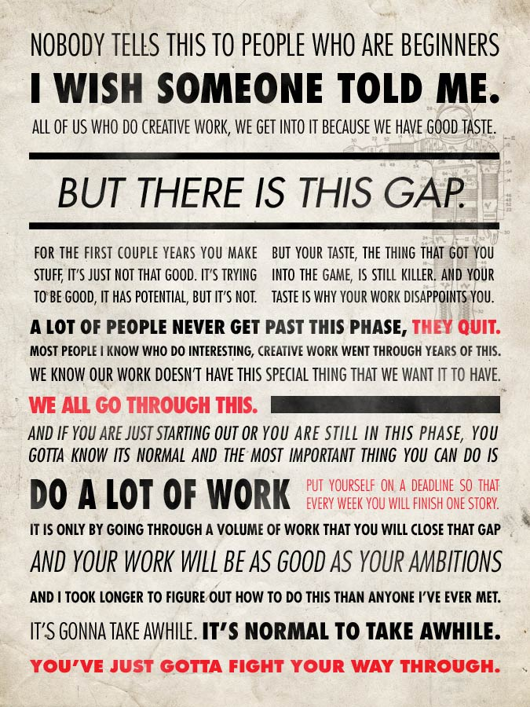

# Phase 3 guide

## Welcome to Phase 3

Welcome from your teachers.  Phase 3 is the most exciting phase here at DBC.
In this phase we no longer view you as students or developers-in-training,
rather we look at you to be valuable, albeit junior, collaborators in the craft
of software development.  This will define how we interact and how we assign
and tackle challenges.  Similarly, and you should no longer think of yourselves
as "classmates" but rather "teammates" or "coworkers."

## TL;DR

You should read it all, but...

* We're going to treat you like developers.  This means:
  * Github based code review
  * Pointed criticism
  * Teachers won't ask "do you need help."  You're going to have to ask for it
  * Remember IKE
  * Don't be late
  * Don't be lazy
* We want to give you real-world, project-based challenges
* Use Rails, but don't become a "Rails developer." Become a great developer and
  the tech won't matter
* Think critically
  * Don't trust all you read or hear about fads and fashions in tech
  * When asking for help form a Good Question
  * When asked for help ensure you're being asked a Good Question.  Be Kind,
    but guard your time
* Be polite
  * Realize if you start talking at someone you might break their train of thought
  * Observe the headphone rule - this applies to staff and peers alike
* Read the rest of this but uses these points as a cultural guide. You may need
  to revisit this document multiple times

## Daily Schedule

- Lectures
  - We will lecture around 9:00 and 2:00 daily
  - ...but we will ocassionally have surprise break-outs
  - ...and we may occasionally drop lectures if we think we'll be interrupting your flow
  - Will feature only one laptop, _mine_.  Invest in a pen or pencil as well as a notebook that make you happy

## Challenges

Challenges will be bigger and more vague. A lot of the challenge's value will
be realized in strategizing how to approach the problem.  The emphasis of
challenges is on the process of problem solving and articulating a solution in
code well.  _We expect that you can complete any challenge at this point.
**HOW** you complete it is at stake_.  Code quality is #1.

## Rails

Rails is a powerful tool.  While you've had to write and re-write the same
boilerplate code dozens of times in Sinatra skeleton, Rails will make it
**much** easier to get up and running and take the boilerplate away.

That said, Rails can become _too_ "zealous" in its code generation.  While we
bless your *exploration* of the powers of `rails generate` **do not use it** in
these challenges.  The ability to write Rails code (models, controllers, and
views) from a blank editor screen is a skill you **must** develop.  An
interviewer will be none-too-impressed if your ability to write a controller is
hamstrung by access to the Rails generators.

**EXCEPTIONS**:  You may feel free to `rails generate migration`.  Why?  Because
figuring out time-stamps is irritating.  Also if you install a gem (for
instance `rspec-rails` which finalizes its install by running a `rails
generate` command, feel free).

## Feedback

Don't be attached to your code, our job is to be critical and opinionated :)
Occasionally a criticism will be reducible to a question of style.  Your
teachers are professional Rails developers.  We may occasionally give you
guidance that is justified by "that's not idiomatic Rails."  That's "taste" and
while we hope you have aquired some sense of it in the previous phases, we will
try to help you further refine it during our time together.

In Phase 3, part of our goal is to debug your thought process.  If you say you
are weak, we will give you exercises.  If you give us a bad process, we will ask
you to find your own weakness.  If you criticise the challenges we give you, we
will make you fix them.  If you complain that something "doesn't work" we will
ask you to explain what you've done to understand the problem.

In short, we're going to ask you to be completely **responsible**.  Lamentably
this expectation seems to have gone out of fashion these days, but that is not
the case here.

### On Taste

While you're fighting through the process of learning to exercise your
creative desires in terms of your tastes, remember to [Do It Anyway][]

[Do It Anyway]: https://medium.com/human-parts/do-it-anyway-aea83405b60e

-- Ira Glass

## De Sententiis (On Opinions)

When someone gives you an observation, it is your obligation to hold them
accountable to that opinion.  When a coach comes along and says "ERB sucks,
HAML is the bomb" it is your **job** to ask that individiual:  "Why do you say
this?  What problem does this solve?  What companies are using this?  Who are
the main contributors on this?  What's their philosophy?  What's the point of
view behind this thing?"

While it's important to leave your mind open for input, it's also important to
know when you need *not* heed some advice.  As Kipling says in "If:"

    If you can trust yourself when all men doubt you,
        But make allowance for their doubting too;...
    Yours is the Earth and everything that’s in it

## Review

Github review is the most scalable way for us to give you feedback on your
code.  It is also the format you will be using in your professional career.
If @-mentioend in a github review, your teachers will try to provide some feedback.
We will also be conducting code reviews for specific challenges.

## Questions

We are here to help.  Everyone who teaches at DBC has made a decision to use
their development talents and passion to help fuel that selfsame passion in
others.  That said, by teaching you how to ask questions, we can make sure your
learning here and beyond is much more successful.

### Whom To Ask

You should ask _yourself_ first, _your pair_ second, _your peer_ third and a
teacher _last_.  When engaging with any of these parties, most especially the
first party, it is absolutely paramount that you ask the question properly.
80% of the time a question that would be asked of another or of a forum could
be avoided entirely if the asker takes the time to formulate the question
clearly.  Your teacher demands that you ask me focused, targeted questions that
indicate the strength and character of your mental model.

### How to Ask Good Questions

An invaluable guide on asking questions can be found here:
[Asking Smart Questions by Eric Raymond][ASK].

To be clear "asking a question" is not the same as "telling a story."  Telling
a story tells us what the user story or feature was that you're implementing.
Saying that the story's goal doesn't work is not a question.  It says you're
_en route_ to asking a question but you've not isolated the essential tripping
point that's preventing your story from having a happy ending.  Story-telling
is a great first step, but it is not the step where you should reach out for
help.

When you ask a question look for seams between "what I have here it what I
expect" and "what I get back is not what I expect".  That tunnel that takes the
"what you expect" and turns it into "what you didn't expect" is where your bug
is.  If that tunnel, i.e. your code, is small and focused, your bug should pop
out.  If it is a snarl of spaghetti, it will be difficult to figure out.  We
call this process "debugging."

Have log files, unit tests, etc. handy when you engage these peers and we will
be able to focus, solve, and move on.  If anyone asks for help but doesn't show
you the respect of formulating a question, you should ask them to formulate a
clearer question for you.  All our time is precious and we must all show each
other due respect.

### Manage Your Time

That said, if you feel you are spending too much time on a question, **stop**
and ask for help.  Try to ask for it in a way that means you've tried to debug
the problem, but if you're living a reality that will make statements of the
form "I spend 3 hours on this one bug" true, ask for help.  You may be
struggling with code which relies on a broken mental model.

## On Interruption

Developers' time is valuable and in the real world you will work alone much
more than you will work paired. Your business value proposition (i.e. that you
generate more revenue than you cost) requires that you generate value
efficiently; this expectation holds for all of your peers as well. Please have
some politness and respect for your interlocutor's time e.g.:

> "Hey Irene, I see you're staring off into space, can you explain to me what
this method does?"

or

> "Coach Derpington, can you tell me how to create a JavaScript class?"

Shouting something that's on the top of your mind to someone who has headphones
in may result them losing their focus. Assuming that other peoples' time and
attention is yours for the taking is flat-out rude and is not tolerated
professionally.  Be willing to accept deferral and to defer. It's not saying "I
don't like you" or "I don't know," it's saying "I'll be more receptive to you
in just a little bit."  Respect this.

Incidentally, those whom you would interact with will be much more willing to
help you a second time if you ask focused questions (and for extra points)
write things down.

[Artist's rendering of the above](http://cdn.themetapicture.com/media/funny-programmer-comic-understand-message.jpg)

## Three Agreements

We expect continued adherence to the three agreements

>Three Agreements
>
>Integrity: We do what we say we will do. We do things that reflect our values.  
>Kindness: We go beyond being deliberately nice to each other. Sometimes kindness means having a hard conversation. 
>Whole Self: We bring our keen intellects, strong work ethics, and quirky personalities with us every day. We respect the good and bad in each other; relishing the good days and the bad.

## Conclusion

- Don't be attached to your code, our job is to be critical and opinionated :)
- Teachers will be conducting code reviews for specific challenges. Some of these will happen on GitHub's pull requests and others will happen live, face to face.
- This is a no-shame ask-anything environment provided you have done your
  utmost to express the question well
- All our challenge solutions/repos should be under phase organization.
- Make sure you check out [Phase 3 Git Workflow](../../../phase-3-guide/blob/master/git-workflow.md#phase-3-github-workflow)
- Don't burn out, take care of each other.

### Student Handbook

The [student handbook](../../../student-handbook) has information about DBC's agreements, policies, and rules. Please review it.

[ASK]: http://www.catb.org/esr/faqs/smart-questions.html
