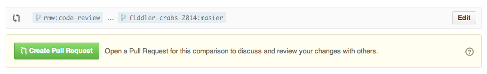

# How to get a code review

I have forked your projects into my own Github account.

Create a pull request from your cohort repository into my repository.

In your pull request, include:

* list of features in this pull request
* screenshots of new front-end features

